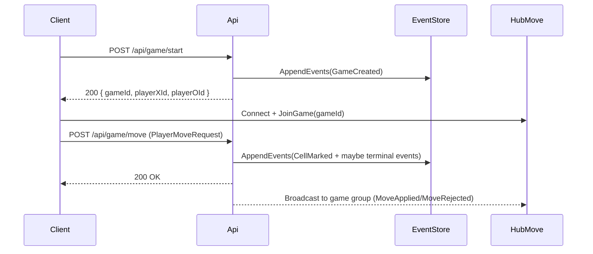
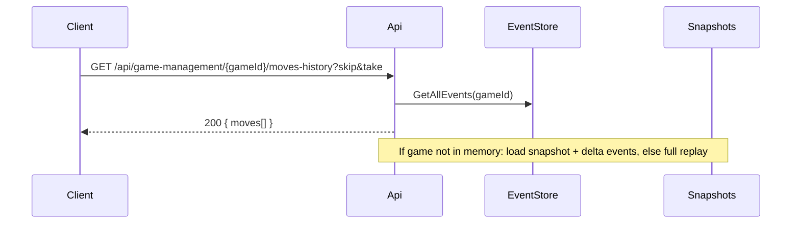
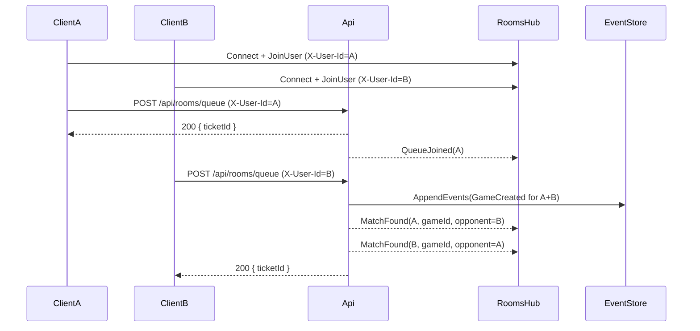
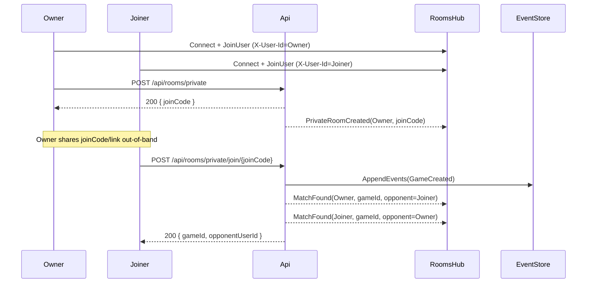
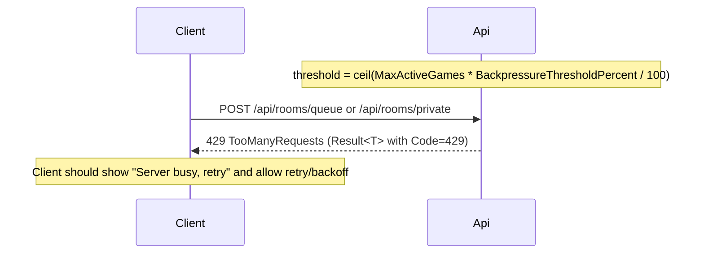

# User flows (frontend reference)

This document describes the primary frontend user flows and how they map to backend HTTP + SignalR.

## Conventions
- Identity: `X-User-Id: <guid>` header.
- Scalar (dev): `/scalar/v1`
- Game hub: `/move-updates-hub`
- Rooms hub: `/rooms-hub`

## Start game and play moves



## Reconnect / resume (history + rehydrate)



## Regular matchmaking (queue -> match -> game)



## Private room (create -> share code -> join -> game)



## Expiry flows (best-effort notifications)

```mermaid
sequenceDiagram
  participant Worker
  participant Api
  participant RoomsHub
  participant Mongo

  Note over Mongo: TTL deletes are eventual; worker sweeps frequently
  Worker->>Mongo: Find expired queued tickets / half-full rooms
  Worker-->>RoomsHub: QueueExpired(userId, ticketId)
  Worker-->>RoomsHub: RoomExpired(userId, roomId, type)
```

## Backpressure (near capacity -> 429)



